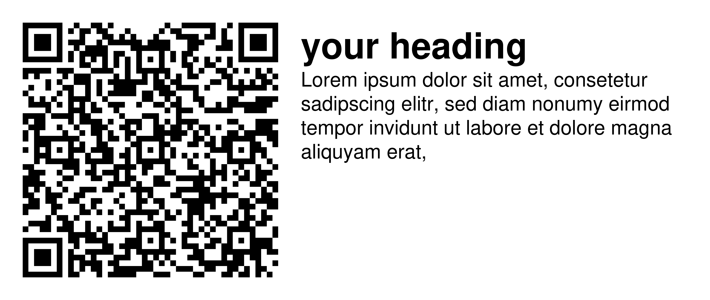
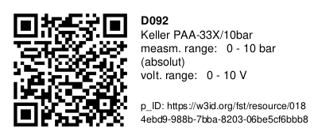

# FST Label Creator
## Introduction
This is the repository of the FST Label Creator software/python package. The goal of this software is to provide user friendly functions to generate labels that contain a QR-Code and some text/loaded data. In more detail this can be used to generate persistend Identifier (p_ID) Labels where the QR-Code points to a p_ID URL like https://w3id.org/fst/resource/0184ebd9-988b-7bba-8203-06be5cf6bbb8 and the text displays information about the referenced object.
<br>
This software also supports placing those labels onto a DIN A4 .pdf site template, to be able to print the .pdf sites, and therefore your own labels. Also bulk creation and placing with data read out of excel tables is supported. <br>
Currently this software only supports the bulk creation of sensor p_ID labels and normal text labels where the text gets encoded inside the QR code instead of the p_ID URL with data read out of excel tables.
For visible examples for the different label models please have a look at the 'How to use this package?'-section. Examples for full .pdf pages with placed labels and a test fit background can be found behind the following hyperlinks: [p_ID sensor labels full page test fit](SUPPORTED_TEMPLATES/test_fit_template_AveryB7651.png) and [labels with heading full page test fit](SUPPORTED_TEMPLATES/test_fit_template_AveryL6009.png).

<b> DISCLAIMER: </b> <br>
1. This software is in a early testing and validating stage. It is not commented out sufficient, the functional segregation isn't good and in conclusion the function and variable names might be the subject to siginificant change in the future. All this mentioned reasons are the explaination why this software doesn't provide a API with backwardscompatibility yet. Please keep that in mind, when you use this software.
The decision to leave this software as it is in the current state without refactoring is made because in order for this software to be of high impact it needs to be possible to load the data from somewhere off the internet and to efficiently label all types of objects like materials and test-objects (not just sensors). The closest to think of that could solve this problem is RDF + Ontologies. These topics are still under research and therefore software that gets developed at the FST that uses these technologies in early concept stages. Also the feasibility and effectiveness of this technologiers for the choosen goals still need to be proven. In order to prevent time and cost intesive addditional work, that possibly could be rendered somehow useless or inpracticable in the future, the decision to prove the feasibility and effectiveness of the rdf software first is made.
2. The persitent ID namespace (`https://w3id.org/fst/resource/`) for the sensor labels is currently hardcoded into the `script_functions.py` file and therefore your generated sensor labels will point only to this persitent ID namespace. A #TODO to remove this limitation and give differnt users more liberties is already added.


## Installation Instructions:
### Introduction (all platforms):
You need to have python3 (>3.10 https://www.python.org/) and inkscape (https://inkscape.org/) installed. <br>
Also it is recommended, for development explicitily needed, to use the python package manager poetry (https://python-poetry.org/). <br>

If you just a user of the library you can get along with the "venv" program, that gets shipped together with python. Therefore you don't need to download and install poetry just to use this software.
For installation introductions on windows with venv please have a look at the next sub section.

### On Windows with venv:
0. Please make sure, as already mentioned, you have python3 (>3.10 https://www.python.org/) and inkscape (https://inkscape.org/) installed
1. Clone or download this FST Label Creator git-repository
2. Please navigate with your command line program inside the folder where this README.md is located (for example with `cd C:\Users\Neumeier\Desktop\fst-label-creator`)
3. Inside this folder run with the Windows command line "cmd" the command `py -m venv env`. (This will create a virtual environment, that won't mess up your system python installation)
4. Next run the command `.\env\Scripts\activate` to activate that environment
5. After setting up the virtual environment you are ready to install the neccessary packages with the command `py -m pip install qrcode reportlab svglib pandas openpyxl`
6. Next you are able to run the scripts with for example `python .\main.py`

7. At the end please deactivate the virtual environment with `.\env\Scripts\deactivate`


## How to use this package?
1. Please make sure you followed the installation intructions properly.
The example excel sheets can be found inside the `./tests/` directory.

2. Next create a `test.py` Python file inside this folder.

3.
- If you want to bulk create labels with a heading, like this,


from a excel sheet use the following code and please adjust the used paths accordingly:

```python
from pathlib import Path

from fstlabelcreator import script_functions

# Set the paths
path_for_generated_files: Path = Path(f'./_generated')
path_for_generated_files_text_label_from_excel_sheet: Path = Path(f'{path_for_generated_files}/text_label_from_excel_sheet')
path_to_text_excel_sheet: Path = Path(f'./id_list.xlsx')

script_functions.generate_label_sites_from_excel_sheets(path_for_generated_files= path_for_generated_files_text_label_from_excel_sheet,
                                                        path_to_text_excel_sheet= path_to_text_excel_sheet,
                                                        supported_template= script_functions.SUPPORTED_TEMPLATES['L6011'])
```
- If you want to bulk create PID labels for sensors, like this,


from a excel sheet please use the following code and adjust the used paths accordingly:

```python
from pathlib import Path

from fstlabelcreator import script_functions

# Set the paths
path_for_generated_files: Path = Path(f'./_generated')
path_for_generated_files_pID_label_from_excel_sheet: Path = Path(f'{path_for_generated_files}/pID_label_from_excel_sheet')
path_to_sensor_excel_sheet: Path = Path(f'./info_Messtechnik_Uebersicht_FST_Wetterich.xlsx')

script_functions.generate_sensor_pID_label_sites_from_excel_sheets(path_for_generated_files= path_for_generated_files_pID_label_from_excel_sheet,
                                                                   path_to_sensor_excel_sheet= path_to_sensor_excel_sheet,
                                                                   responsible_WiMi= 'Rexer')
```

## Supported Templates
Currently supported are the following templates:
- #TODO: Check whether AveryZweckform uses the same template on every different product range with the same number of labels on each DIN A4 page (for example 65, 27, 48 and so on)
1. <b> 'B7651'</b>: AveryZweckform B7651-? Ultra-Resistente Etiketten 38mmx21mm (65 labels per DIN A4 page)
2. <b> 'L6011'</b>: AveryZweckform L6011-? Typenschild-Etiketten 63.5mmx29.6mm (27 labels per DIN A4 page)
3. <b> 'L6009'</b>: AveryZweckform L6009-? Typenschild-Etiketten 45.7mmx21.2mm (48 labels per DIN A4 page)

## Improvement Suggestions
- Overall refactoring and restructuring of the code (especially if the software should be extended in the future)
- Implement a rdf library to be able to load rdf data that can be used on the labels. Maybe add also function that sorts different information by the order of given rdf tags. Also handel edge cases that everything fits well and add output with suggestions if it doesn't. This also could be a type of "template function"
- A function that fits the pid template on different given or label sizes. On larger objects bigger labels with bigger text could be needed to be able to find and read the text from a bigger distance.
- Write a CLI for the program
- Add a CI/CD testing pipeline for this repository (please choose a docker image where you can install inkscape) and extend the tests
- Add a function that automatically test fits a generated site on the used template .pdf/.png ()
- Add additional label sizes to the supported_templates / Add a contributing guide on how other people can add a new template and what they need to provide for it to be accepted
- Improve the outputs off the software, maybe add the logging module that prints the output properly. The placement of the labels should still be displayed e.g. "Place label xy on site_z at (...)", "Starting new site" "Generate QR-Code ...", ..
- Extend the placing function, that places the labels on the site, by an index that describes where the first label should be placed on somewhere in the middle of the site. To be able to reuse label sites that didn't got used up completely
- If this software should get extended and published in the future add a table of contents to this README.md and properly structure it
- If this software should get extended and published in the future add a contributing file and split it in one part for contributing/refactoring code and one for contributing sizes for new templates that should get supported
- If a CI/CD pipeline is added for this repository and even more URLs should be used in the documentation add a URL checker to check this URLS if they still resolve properly
- Is a parsing function viable to have more control over the formatting?
- Add use cases as examples to this repository
- Move the supported templates inside their own file(s) or even directory
- Add a section that describes the used excel sheet format conventions in more detail, that the users know how to use and modify them

## Current To Do List:
- test the path of inkscape on a windows machine
- test the other two "supported" label sizes "L6011-?" and "L6009-?"
- Work on/handle the #TODO comments in the code base
- Take a look at the incskape bug
- Convert the use of pandas to load the excel sheets to openpyxl as it is used in the background anyway to be able to drop pandas as dependency
- Implement a function that creates directories recurseviely if they shouldn't exist when the user references a save-to location.
- Make the currently hardcoded persistent namespace (`https://w3id.org/fst/resource/`) inside the `script_functions.py` file a function argument. That will enable users outside the FST to also generate their own sensor labels.

## Dependencies:
This python package uses the following third party python packages and software as dependency:
- qrcode (https://pypi.org/project/qrcode/ [Last Access at 03th October 2023])
- reportlab open source version (https://pypi.org/project/reportlab/ [Last Access at 03th October 2023], https://docs.reportlab.com/reportlab/userguide/ch1_intro/ [Last Access at 03th October 2023])
- svglib (https://pypi.org/project/svglib/ [Last Access at 03th October 2023])
- pandas + openpyxl (to load the data of the excel sheets) (https://pypi.org/project/openpyxl/ [Last Access at 03th October 2023])
- Inkscape (https://inkscape.org/ [Last Access at 03th October 2023])

## Current Maintainers:
sebastian.neumeier[at]stud.tu-darmstadt.de <br>
manuel.rexer[at]fst.tu-darmstadt.de <br>


